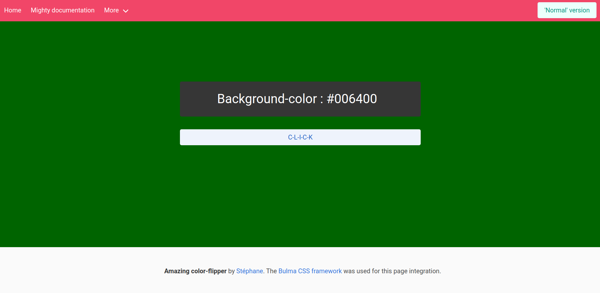

# color-flipper

Creating a simple color-flipper. 
> "Cause we all need a color-flipper to color our lives."
> 
> - <strong>_Socrates_</strong>

## How to run this amazing project

Clone this repository:
```bash
git clone git@github.com:Dananando/color-flipper.git
```

Open the html file with your browser. For example:
```bash
chromium ./html/index.html
```

Enjoy randomly coloring your life.

## What it should look like



## Responsiveness

This project is not responsive at all. This will be fixed in an upcoming version since it has been asked by an insane number of users.